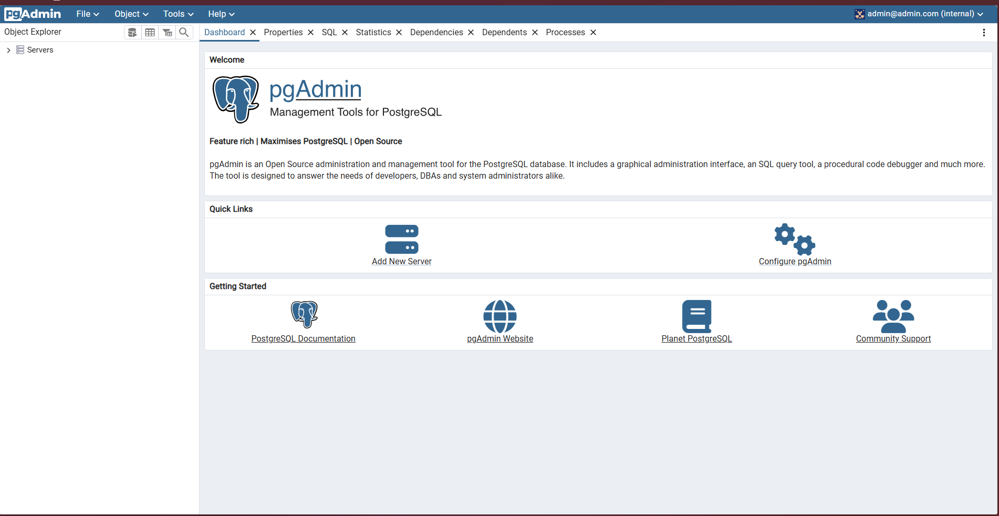
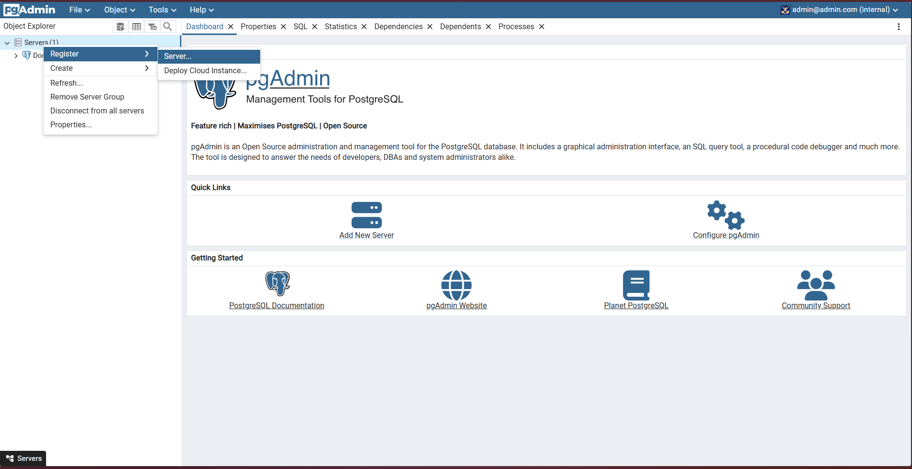
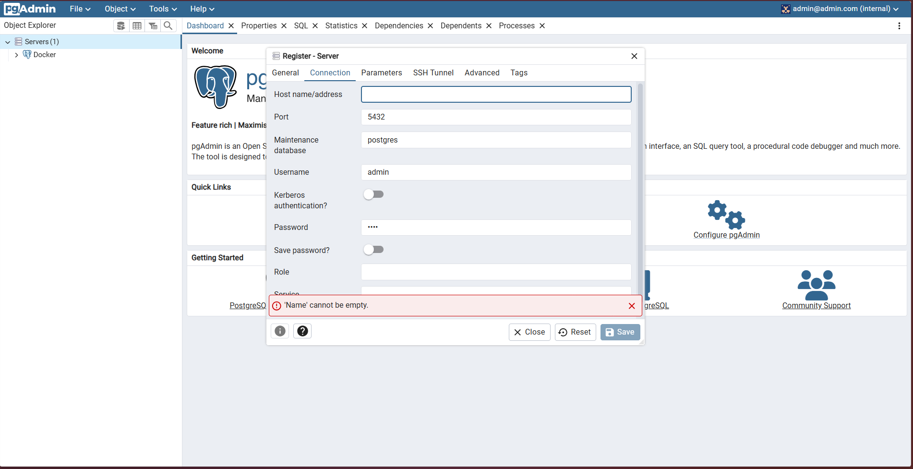
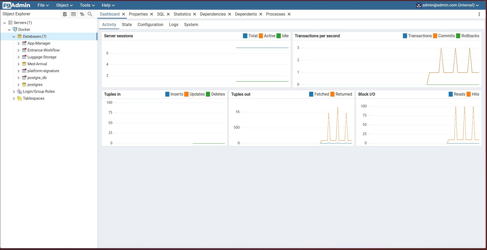
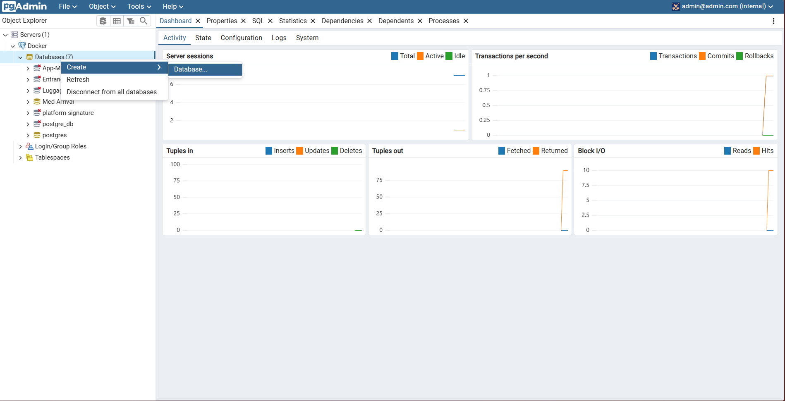
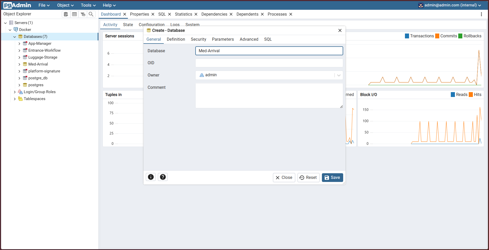

# Med-Arrival Project

This project consists of a full-stack application with PostgreSQL database, pgAdmin interface, Spring Boot backend, and frontend services running in Docker containers.

## Prerequisites

-   Docker and Docker Compose installed on your system
-   Git (for cloning the repository)

## Getting Started

### 1. Clone the Repository

1. Clone the repository:

    ```sh
    git clone https://github.com/YoussefOutahar/MedArrival.git
    cd MedArrival
    ```

### 2. Accessing the Database through pgAdmin

#### Adding a Server

1.  Open pgAdmin in your web browser at http://localhost:5050.

    

2.  Log in using the credentials:

    -   Email: admin@admin.com
    -   Password: root

        

3.  In the pgAdmin interface, right-click on "Servers" in the Browser panel on the left and select "Register" > "Server...".

    

4.  In the "Create - Server" dialog, enter the following details: - **General Tab**: - Name: Med-Arrival - **Connection Tab**: - To get the host address, run the following command:

    ```s
    docker inspect -f '{{range .NetworkSettings.Networks}}{{.IPAddress}}{{end}}' <container-id>
    ```

    -   Host name/address: [output of the above command]
    -   Port: 5432
    -   Maintenance database: postgres
    -   Username: admin
    -   Password: root

    

5.  Click "Save" to add the server.

#### Creating the Database

1. In the pgAdmin interface, expand the newly created "Med-Arrival" server in the Browser panel.

    

2. Right-click on "Databases" and select "Create" > "Database...".

    

3. In the "Create - Database" dialog, enter the following details:

    - **General Tab**: - Database: Med-Arrival - Owner: admin

    

4. Click "Save" to create the database.

### 3. Start All Services

1. Start all services:
    ```sh
    docker-compose up --build -d
    ```
    This command will start all services in detached mode. Initial startup might take several minutes as Docker builds the images.

### Accessing Services

-   Frontend: http://localhost:3000
-   Backend API: http://localhost:8080
-   pgAdmin: http://localhost:5050
    -   Email: admin@admin.com
    -   Password: root
-   PostgreSQL Database:
    -   Host: localhost
    -   Port: 5432
    -   Database: Med-Arrival
    -   Username: admin
    -   Password: root


### Stopping the Application

To stop all services:

```sh
docker-compose down
```

To stop all services and remove volumes:

```sh
docker-compose down -v
```

## Project Structure

### Database Layer

-   **PostgreSQL (container-pg)**

    -   Primary database service
    -   Persistent data storage using Docker volumes
    -   Configured with health checks
    -   Runs on port 5432

-   **pgAdmin (container-pgadmin)**
    -   Database management interface
    -   Accessible through web browser
    -   Depends on PostgreSQL service
    -   Runs on port 5050

### Backend Layer

-   **Spring Boot Application (backend)**
    -   Built using Gradle
    -   Configured for production environment
    -   Includes health checks via actuator
    -   Optimized JVM settings and thread pool configuration
    -   Runs on port 8080
    -   Depends on PostgreSQL service
    -   Security hardening with no-new-privileges restriction

### Frontend Layer

-   **Web Application (frontend)**
    -   Served via Nginx
    -   Containerized build process
    -   Configured with health checks
    -   Runs on port 3000
    -   Security hardening with no-new-privileges restriction

### Networking

-   All services communicate through a shared bridge network
-   Each service exposes specific ports for external access
-   Internal service discovery using Docker DNS

## Troubleshooting

### View Logs

To view logs for a specific service:

```sh
docker-compose logs [service-name]
```

Available service names:

-   postgres
-   pgadmin
-   backend
-   frontend

### Check Service Status

```sh
docker-compose ps
```

### Restart a Specific Service

```sh
docker-compose restart [service-name]
```

### Common Issues

1. If database connection fails:

    - Ensure PostgreSQL container is healthy
    - Check database credentials
    - Verify network connectivity

2. If services won't start:
    - Check if ports are already in use
    - Ensure Docker daemon is running
    - Verify sufficient system resources

### Backup Database

To create a database backup:

```sh
docker exec container-pg pg_dump -U admin Med-Arrival > backup.sql
```
